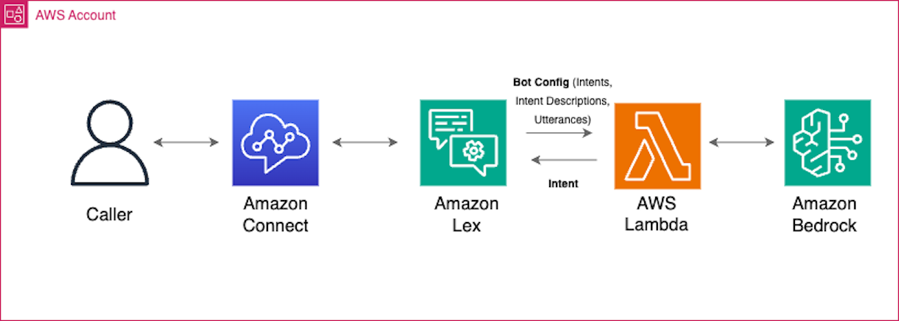

# Enhancement Of Amazon Connect And Amazon Lex With GenAI Capabilities

In this solution, we showcase a practical application of Amazon Connect integration with Amazon Lex and Amazon Bedrock/Titan to improve the understanding of intents.

## Overview of the solution
The solution is composed of an Amazon Connect instance with a contact flow with a ‘Get Customer Input’ block that uses Amazon Lex. Amazon Lex is configured with an AWS Lambda Function to process utterances for which the intent cannot be determined and gets routed to the FallbackIntent. 


**Figure1 – Architecture**

## Getting started

### Prerequisites

For this solution, you need the following prerequisites:
* A basic understanding of the Amazon Connect contact center solution using Amazon Lex and Amazon Bedrock
* An AWS account [https://docs.aws.amazon.com/signin/latest/userguide/what-is-sign-in.html] with an AWS Identity and Access Management (IAM)[https://aws.amazon.com/iam/] user with permissions to deploy the CloudFormation template [https://aws.amazon.com/iam/]
* The AWS Command Line Interface (AWS CLI)[https://aws.amazon.com/cli/] installed and configured for use[https://docs.aws.amazon.com/cli/latest/userguide/cli-chap-configure.html].
* Docker[https://docs.docker.com/get-docker/] installed and running for building the AWS Lambda container image.
* Python 3.9 or later, to package Python code for the Lambda function.
* jq installed[https://jqlang.github.io/jq/download/]

### Deploy the sample solution

To implement the solution, complete the following steps:

1.	Clone the repository:

```bash
git clone https://github.com/aws-samples/amazon-connect-with-amazon-lex-genai-capabilities
cd amazon-connect-with-amazon-lex-genai-capabilities

```

2. Run the following command to initialize the environment and create an Amazon Elastic Container Registry(Amazon ECR) repository for our AWS Lambda function's image. Provide the AWS Region and ECR repository name that you would like to create.

```bash
bash ./scripts/build.sh region-name repository-name

```

3. Update the ParameterValue fields in the scripts/parameters.json file.
   1. ParameterKey ("AmazonECRImageUri") - Enter the repository URL from the previous step.
   2. ParameterKey ("AmazonConnectName") - Enter a unique name.
   3. ParameterKey ("AmazonLexBotName")  - Enter a unique name.
   4. ParameterKey ("AmazonLexBotAliasName") - The default is "prodversion" ; you can change it if needed.
   5. ParameterKey ("LoggingLevel") - The default is "INFO"; you can change it if required. Valid values are DEBUG, WARN, and ERROR.
   6. ParameterKey ("ModelID") - The default is "anthropic.claude-instant-v1"; you can change it if you need to use a different model.
   7. ParameterKey ("PredictionConfidence") - The default is "0.75"; you can change it if you need to update the confidence score.

4. Run the command to generate the cloudformation stack and deploy the resources:

```bash
bash ./scripts/deploy.sh region cfn-stack-name

```

If you don't want to build the contact flow from scratch in Amazon Connect, you can import the sample flow provided with this repository[filelocation: /contactflowsample/samplecontactflow.json].

  5. Log in to your Amazon Connect instance. The account must be assigned a security profile that includes edit permissions for flows.
  6. On the Amazon Connect console, in the navigation pane, under Routing, choose Contact flows.
  7. Create a new flow of the same type as the one you are importing.
  8. Choose Save and Import flow.
  9. Select the file to import, and choose Import. 
  
When the flow is imported into an existing flow, the name of the existing flow is updated, too.

  10. Review and update any resolved or unresolved references as necessary.
  11. To save the imported flow, choose Save. To publish, choose Save and Publish.
  12. After you upload the contactflow, update the following configurations
      1. Update the 'GetCustomerInput' blocks with the correct Amazon Lex bot name and version.
      2. Under Manage Phone Number, update the number with the contactflow or IVR imported earlier.

## Clean up
To clean up your resources, run the following command to delete the ECR repository and CloudFormation stack:

```bash
bash ./scripts/cleanup.sh region repository-name cfn-stack-name

```

## Authors and acknowledgment
* Hamza Nadeem
* Parag Srivastava
* Ross Alas
* Sangeetha Kamatkar

## Contributing
TBD


